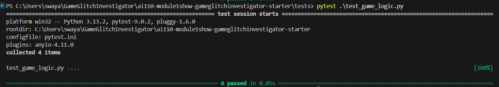
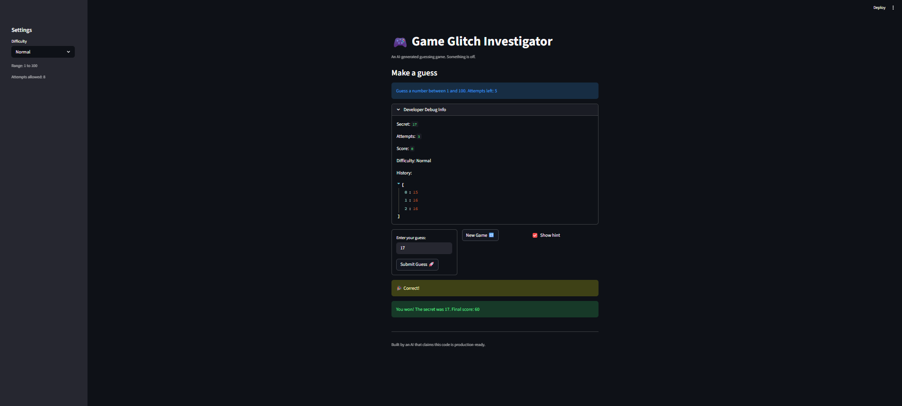

# 🎮 Game Glitch Investigator: The Impossible Guesser

## 🚨 The Situation

You asked an AI to build a simple "Number Guessing Game" using Streamlit.
It wrote the code, ran away, and now the game is unplayable.

- You can't win.
- The hints lie to you.
- The secret number seems to have commitment issues.

## 🛠️ Setup

1. Install dependencies: `pip install -r requirements.txt`
2. Run the broken app: `python -m streamlit run app.py`

## 🕵️‍♂️ Your Mission

1. **Play the game.** Open the "Developer Debug Info" tab in the app to see the secret number. Try to win.
2. **Find the State Bug.** Why does the secret number change every time you click "Submit"? Ask ChatGPT: _"How do I keep a variable from resetting in Streamlit when I click a button?"_
3. **Fix the Logic.** The hints ("Higher/Lower") are wrong. Fix them.
4. **Refactor & Test.** - Move the logic into `logic_utils.py`.
   - Run `pytest` in your terminal.
   - Keep fixing until all tests pass!

## 📝 Document Your Experience

- [x] Describe the game's purpose.
- [x] Detail which bugs you found.
- [x] Explain what fixes you applied.

### Game Purpose

This app is a Streamlit number-guessing game where the player selects a difficulty, guesses a secret number, and gets hint feedback after each guess. The goal is to win within the allowed number of attempts while keeping the best possible score.

### Bugs Found

1. The secret number state was not stable across interactions, which made the game feel inconsistent between reruns.
2. Guess feedback behavior was unreliable, which caused confusion around whether the player should guess higher or lower.
3. Input handling needed stronger validation so empty/non-numeric input would be handled safely.

### Fixes Applied

1. Consolidated game reset behavior into a dedicated reset flow that manages `secret`, `attempts`, `status`, and `history` in session state.
2. Kept the secret value in Streamlit session state so the round remains consistent during form submissions.
3. Corrected outcome logic so `check_guess()` returns the right result (`Win`, `Too High`, `Too Low`).
4. Refactored reusable logic into `logic_utils.py` (`check_guess`, `parse_guess`, difficulty range helper, and score updates).
5. Verified test coverage in `tests/test_game_logic.py` and confirmed tests pass.

## 📸 Demo

- [ ] [Insert a screenshot of your fixed, winning game here]
      
      

## 🚀 Stretch Features

- [ ] [If you choose to complete Challenge 4, insert a screenshot of your Enhanced Game UI here]
      I did not do challenge 4
